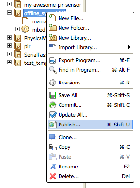
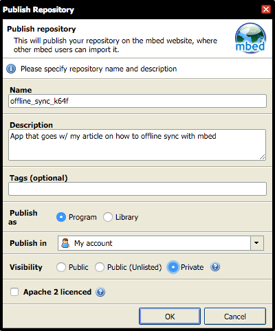
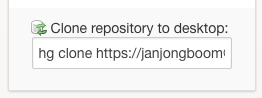
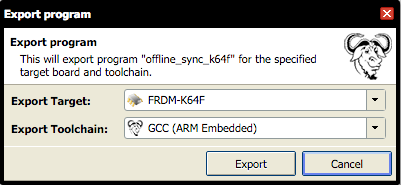
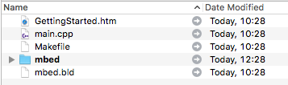
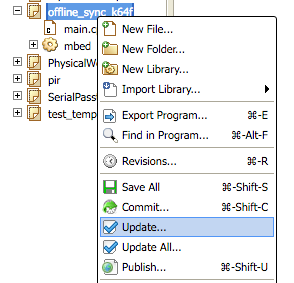
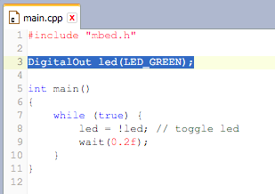
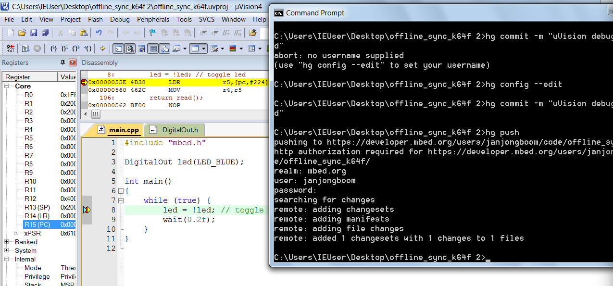
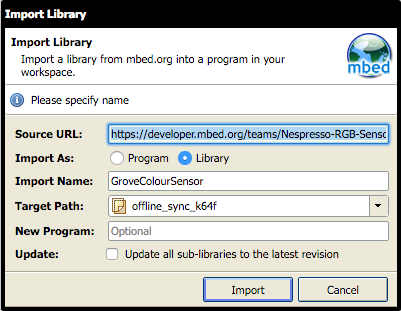
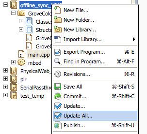

# Offline mbed

Let's write a program, quite simple, depend on 'mbed' library. Target is not important, but I'm using K64F.

```cpp
#include "mbed.h"

DigitalOut led(LED_RED);

int main()
{
    while (true) {
        led = !led; // toggle led
        wait(0.2f);
    }
}
```

## Taking it offline

Now we like to do online for prototyping but now we want to start doing offline development. First need to 'Publish' so we can have a URL we can clone.



You can choose to publish privately, doesn't really matter, as it's just for you and need to authenticate anyway.



On project page there is text *Clone repository to desktop*.



Point is that we could clone this repo, but not really useful as it does not contain build files or anything like that. So let's do that first. E.g. we want to use GCC. Go back to online compiler, right click on the project and select 'Export'.



We get a ZIP file which contains our source files, a Makefile and the libraries we depend on (mbed).



Open a terminal and go to the folder, verify that it worked by running:

```bash
$ make
```

If it succeeds you get a *.bin file, which you can drag to the board to flash. OK, fine. 

## Taking it back online

Now change the code a little bit, remove line 3, and replace with:

```
DigitalOut led(LED_GREEN);
```

Again, call `make` and flash and verify it works. Now we can commit our changes back. It already backed by the hg repository we created earlier, so when we run `hg status` we'll get some info back here:

```bash
offline_sync_k64f $ hg status
M main.cpp
? main.d
? main.o
? offline_sync_k64f.bin
? offline_sync_k64f.elf
? offline_sync_k64f.hex
? offline_sync_k64f.map
```

We need to configure hg (Mercurial) now:

```bash
hg config --edit
```

And supplying your information. We can commit main.cpp back to mbed now via:

```bash
hg commit -m "Change color from red to green"
hg push
```

You'll be prompted for security credentials. Fill in your ARM mbed username and password in when prompted. Afterwards you'll see something like this:

```
offline_sync_k64f $ hg push
pushing to https://developer.mbed.org/users/janjongboom/code/offline_sync_k64f/
http authorization required for https://developer.mbed.org/users/janjongboom/code/offline_sync_k64f/
realm: mbed.org
user: janjongboom
password:
searching for changes
remote: adding changesets
remote: adding manifests
remote: adding file changes
remote: added 1 changesets with 1 changes to 1 files
```

**Note:** You can store your credentials, so you don't have to type them again all the time. [Here are instructions](http://stackoverflow.com/questions/2584407/how-to-save-username-and-password-with-mercurial).

Now go back to the online compiler, right click on your project and select 'Update':



And now our online program is back in sync again as well.



### Updating offline

If you change something in the online compiler, hit the 'Commit' button, and then hit 'Publish' again to push back to the repository. Locally now run:

```
hg pull
hg update
```

To get the latest revision.

## Debugging

The same approach can be used to export to an environment which supports debugging, e.g. [uVision](https://docs.mbed.com/docs/debugging-on-mbed/en/latest/Debugging/Keil/), [Visual Studio](http://visualgdb.com/tutorials/arm/mbed/) or [Eclipse](https://developer.mbed.org/cookbook/eclipse-for-building-and-debugging).

For instance, here I used the same approach to export to uVision and start a debug session. And we can use the same commands as before to now push the data back to the online compiler:



## Libraries

mbed is pretty great because of all the libraries. However, online libraries work a bit different than offline. In the online compiler we use a single file per library, which contains the repository where the library is located, and the commit hash (version) of the library used.

Let's add a library in the online compiler: [Nespresso-RGB-Sensor/GroveColourSensor](https://developer.mbed.org/teams/Nespresso-RGB-Sensor/code/GroveColourSensor/), by right clicking on your application, and then *Import Library > From URL* and copying in the URL.



We also change `main.cpp` and add a line to reference the library:

```cpp
#include "GroveColourSensor/GroveColourSensor.h"
```

Now commit this change and publish. If we now look in our repository we have a file called [GroveColourSensor.lib](https://developer.mbed.org/users/janjongboom/code/offline_sync_k64f/file/44238a870814/GroveColourSensor.lib) with the following content:

```
https://developer.mbed.org/teams/Nespresso-RGB-Sensor/code/GroveColourSensor/#f6a136b99533
```

When we export this application offline the GroveColourSensor repository is automatically cloned as a a Mercurial repository, and checked out at the right commit. However, if we already took this library offline and added the library at a later stage, this does not work.

```
offline_sync_k64f $ hg pull
pulling from https://developer.mbed.org/users/janjongboom/code/offline_sync_k64f/
searching for changes
adding changesets
adding manifests
adding file changes
added 1 changesets with 1 changes to 1 files
(run 'hg update' to get a working copy)
offline_sync_k64f $ hg update
1 files updated, 0 files merged, 0 files removed, 0 files unresolved
offline_sync_k64f $ make
# snip
main.cpp:2:51: fatal error: GroveColourSensor/GroveColourSensor.h: No such file or directory
 #include "GroveColourSensor/GroveColourSensor.h"
                                                   ^
compilation terminated.
make: *** [main.o] Error 1
```

So let's take a look at the lib file, and add the repository ourselves.

```
# read the path
offline_sync_k64f $ cat GroveColourSensor.lib
https://developer.mbed.org/teams/Nespresso-RGB-Sensor/code/GroveColourSensor/#f6a136b99533
# clone that path
offline_sync_k64f $ hg clone https://developer.mbed.org/teams/Nespresso-RGB-Sensor/code/GroveColourSensor/#f6a136b99533
destination directory: GroveColourSensor
adding changesets
adding manifests
adding file changes
added 6 changesets with 9 changes to 3 files
updating to branch default
2 files updated, 0 files merged, 0 files removed, 0 files unresolved
offline_sync_k64f $ make
arm-none-eabi-size  offline_sync_k64f.elf
   text	   data	    bss	    dec	    hex	filename
  28696	    176	    320	  29192	   7208	offline_sync_k64f.elf
offline_sync_k64f $
```
  
And our build is successful again.

### Keeping libraries in sync (online -> offline)

Similarly, when someone updated a library in the online compiler we need to update the library offline as well. To update, check out the commit hash (the part after '#') in the .lib file. Then checkout this commit in the library folder.

```
offline_sync_k64f $ cat GroveColourSensor.lib
http://mbed.org/teams/components/code/GroveColourSensor/#56d6b711b8c7
offline_sync_k64f $ cd GroveColourSensor
GroveColourSensor $ hg checkout 56d6b711b8c7
0 files updated, 0 files merged, 0 files removed, 0 files unresolved
```

### Keeping libraries in sync (offline -> online)

If you update libraries offline, you'll need to manually update the .lib file. Let's say that the last commit of GroveColourSensor has some problems and we want to revert to the previous commit...

```
e108135:offline_sync_k64f janjon01$ cd GroveColourSensor
e108135:GroveColourSensor janjon01$ hg checkout f0e8304db2a3
1 files updated, 0 files merged, 0 files removed, 0 files unresolved
e108135:GroveColourSensor janjon01$ hg id -i
f0e8304db2a3
```

Copy the hash (what's returned by `hg id -i`) and paste it back into GroveColourSensor.lib. Now commit and push:

```
offline_sync_k64f $ hg status
M GroveColourSensor.lib
offline_sync_k64f $ hg commit -m "Update GroveColourSensor to previous commit"
offline_sync_k64f $ hg push
pushing to https://developer.mbed.org/users/janjongboom/code/offline_sync_k64f/
searching for changes
remote: adding changesets
remote: adding manifests
remote: adding file changes
remote: added 1 changesets with 1 changes to 1 files
```

To update in the online compiler now right click on the project and select 'Update all...':



## Conclusion

ARM mbed is pretty great as an online platform, but it's also easy to take your work offline and do debugging here. Getting your data back and forth requires a little bit of Mercurial knowledge but nothing too crazy.
