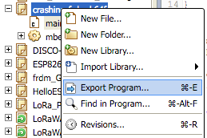
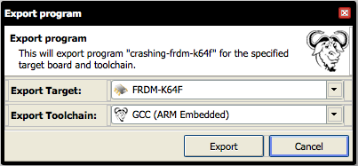
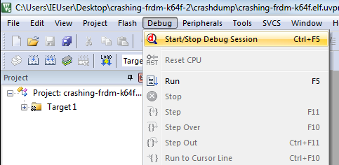
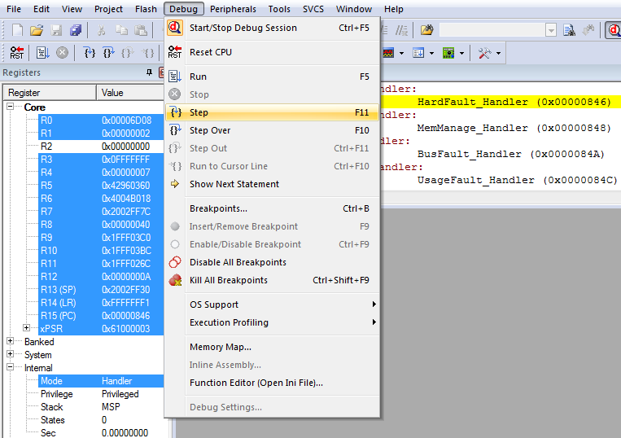
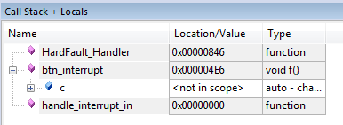
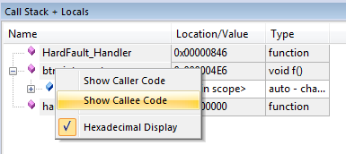
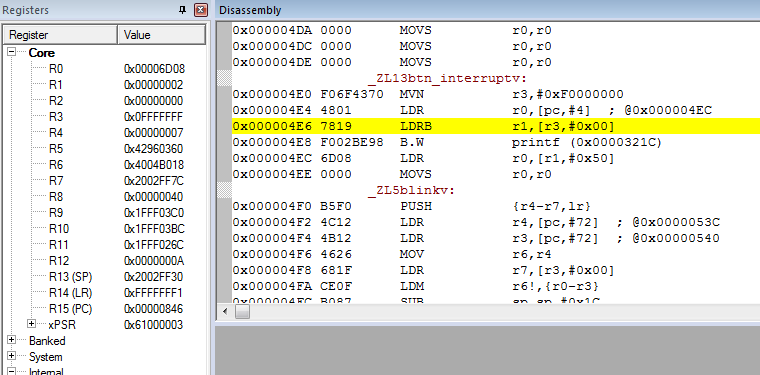
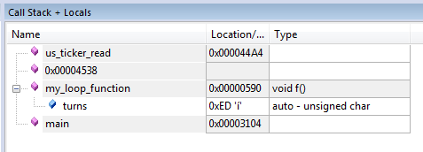

# Post-mortem debugging with ARM mbed

When it comes to programming microcontrollers, the one scenario that you never want to face is a device that suddenly hangs. It's already very frustrating while you're developing software, and tracing down these bugs can be very time-consuming; it's even worse when the device is already deployed in the field. Replicating the exact conditions in which the device failed can be almost impossible in the lab, especially when the failure manifested itself months after deployment.

Fortunately mbed-enabled hardware ships with [CMSIS-DAP](https://developer.mbed.org/handbook/CMSIS-DAP) or its successor DAPLink, which allow you to directly hook into devices using the built-in USB ports (on developer boards), or a debugging probe like [SWDAP](https://developer.mbed.org/teams/mbed/wiki/SWDAP). CMSIS-DAP is responsible for mounting your mbed board as a mass-storage device for easy flashing, but it can also be used to dump the RAM and ROM of a running device, enabling you to do post-mortem debugging on a hanging device.

<!--more-->

In this blog post we'll show you how to install all dependencies, crash a device, and subsequently do a post-mortem debug session. To follow along you'll need:

1. [A development board](https://developer.mbed.org/platforms/) capable of running mbed.
1. An account at [developer.mbed.org](http://developer.mbed.org/) - to write faulty firmware.
1. [ARM KEIL uVision 5](http://www2.keil.com/mdk5/install/) - to load the debug session. On OS X, run uVision in VMWare Fusion; it won't install in VirtualBox.
> **Note:** Unfortunately, you may not be able to run the debug session in an unlicensed version of uVision 5. This depends on the size of your RAM, because of the debugger's [32 Kbyte program limit](http://www.keil.com/demo/limits.asp).
1. Download [dump_firmware_classic.py](https://github.com/ARMmbed/post-mortem-debugging/blob/master/dump_firmware_classic.py) - a Python script that dumps the RAM and ROM off a device, and sets up a uVision 5 project.


This article assumes knowledge of building applications with the mbed online compiler. If you're unfamiliar with mbed, read [Getting started with mbed](https://developer.mbed.org/getting-started/) first.

## Creating a program that crashes

Here's an application that writes to reads from a pointer at address 0xfffffff when the button at `SW2` is triggered. This is an invalid address, and reading from here is not allowed, so the core hard faults:

```cpp
#include "mbed.h"

// change this to reflect a button on your own board
static InterruptIn btn(SW2);
static DigitalOut led(LED1);

static void blink() {
    led = !led;
}

static void btn_interrupt() {
    // this will crash your device!
    char* c = ((char*)0xfffffff);
    printf("I read... %c\n", c[0]);
}


int main() {
    btn.fall(&btn_interrupt);
    
    Ticker t;
    t.attach(blink, 0.5f);
    
    while(1) {}
}
```

Save the program and verify that it compiles.

### Exporting to an offline toolchain

When you build an application with the online compiler you only get access to the firmware. If we want to do a post-mortem debug session we also need the debug symbols for this build. To obtain those we can export the program to an offline toolchain, and build locally.

Right click on your program in the online compiler, and select 'Export'.



Choose *GCC (ARM embedded)* as the toolchain and hit 'Export'.



A ZIP file with the source code of the application, all libraries and a Makefile will download. Extract the ZIP file on your local computer.

#### Building locally

Open a terminal and navigate to the directory where you extracted the ZIP file. We can now build the program locally and obtain the debug symbols.

```bash
$ make
# on some targets (like nrf51-dk), also call $ make merge
```

Use drag-and-drop to copy the *.bin file or *-combined.hex file (one will be there, depending on the board) onto your board to flash the program.

### Starting a post-mortem debug session

Now we can put the [dump_firmware_classic.py](https://github.com/ARMmbed/post-mortem-debugging/blob/master/dump_firmware_classic.py) Python script to good use. Run the script with the crashed device plugged in:

```bash
$ pip install intelhex pyOCD
$ python dump_firmware_classic.py
[1/6] Using build directory '.', verifying build...
[2/6] Build verified. Connecting to board...
[3/6] Board recognized as k64f. Downloading ROM...
[4/6] Dumped ROM. Downloading RAM...
[5/6] Dumped RAM. Creating uVision project...
[6/6] Done. Open 'crashdump/crashing-k64f.elf.uvprojx' in uVision 5 to debug.
```

A crashdump folder is created. It contains debug symbols, the RAM and ROM of the device, and a uVision 5 project file. Double click on the project file to open uVision.

### Loading the session in uVision 5

In uVision, choose 'Debug > Start/Stop Debug Session' to start.




In the Disassembly panel we see that we're in the `HardFault_Handler`, which is expected. We can drill down into the stack by selecting 'Debug > Step'.




Now we get more information about the state of the application. On the right bottom corner we see the Call Stack that led up to the crash. We can see that we passed an interrupt (`handle_interrupt_in`) and that we went through one of our own functions (`btn_interrupt`) right before the device hard faulted.



Now that we found the function we can also find the actual line that our application crashed on. In the Call Stack panel, right click on *btn_interrupt* and select *Show Callee Code*.



We now jump into the disassembled source. On the left panel we see the registers, and in the Disassembly panel we see the assembly that led up to the crash:



By reading through the assembly we see the following:

```
MVN           r3,#0xF0000000            // Move not
LDR           r0,[pc,#4]  ; @0x000004EC // Load word from memory
LDRB          r1,[r3,#0x00]             // Load word from memory (type: unsigned byte)
```

We see that on the last line before the crash we tried to read from registry R3 (`0x0FFFFFFF`) into registry R1. We also see that right after, we call the `printf` function. This maps perfectly to our C++ code, and we found the line which crashed the device.

```cpp
    char* c = ((char*)0xfffffff);
    printf("I read... %c\n", c[0]);
```

## Never-ending loops

This approach can be used for more than just debugging hard faults. We can also use it when a device hangs because it entered a never-terminating loop. Let's look at the following code:

```cpp
#include "mbed.h"

static DigitalOut led(LED1);
static void my_loop_function(void) {
    uint8_t turns = 20;

    while(turns-- > -1) {
        led = !led;
        wait_ms(200);
    }
}

int main() {
    my_loop_function();
    return 0;
}
```

Here `turns-- > -1` will always be true (because turns is a `uint8_t`), so the device will never exit the loop. When we start a post-mortem debug session, we can immediately see the function that we are currently stuck in.




And if we're lucky, we can even see the values on the Call Stack. Showing that `turns` overflowed and is now `0xED`.

## Conclusion

CMSIS-DAP on ARM mbed can be a tremendous help with hard to find issues. The ability to recover a crashed device from the field, and use post-mortem debugging on it, is a great addition to the toolchain of every developer.

To replicate the tests we used in this article, take a look at [post-mortem-debugging on GitHub](https://github.com/ARMmbed/post-mortem-debugging). You'll find the Python script and all source code used in this article. Happy disassembling!

---

*This article was written by [Russ Butler](https://github.com/c1728p9) (Embedded Software Engineer working on DAPLink and pyOCD) and [Jan Jongboom](https://twitter.com/janjongboom) (Developer Evangelist IoT).*
